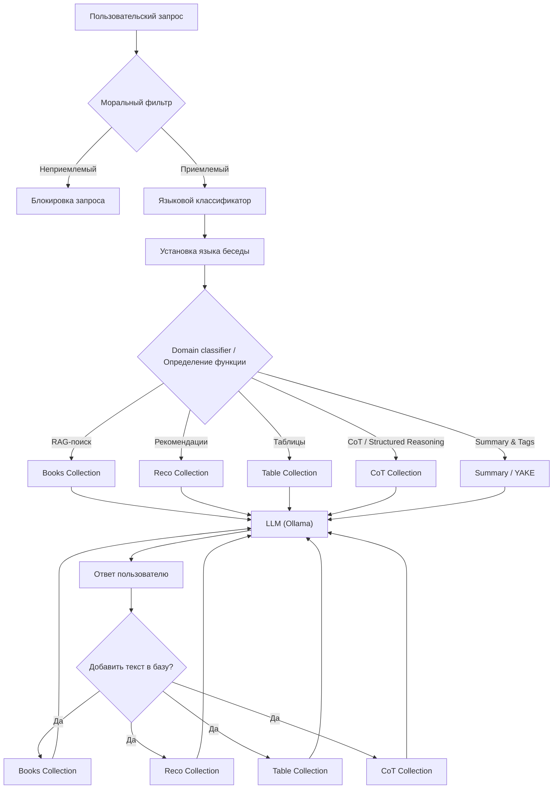

# Ethical LLM Chatbot

Локальный многофункциональный чат-бот на базе LLM с моральным фильтром, RAG, таблицами и CoT.

## Описание

`ethical-llm-chatbot` — интерактивный чат-бот, работающий **локально** с текстовыми базами данных.
Проект демонстрирует:

* Этическую фильтрацию запросов (моральный фильтр)
* RAG (retrieval-augmented generation) для ответов на вопросы по пользовательским базам
* Табличную обработку пользовательских документов
* Пересказ и извлечение тегов
* Решение сложных текстовых задач с промежуточными шагами (CoT / structured reasoning)
* Многоязычность: русский, английский, немецкий, французский

Бот может запускаться в CLI или как Telegram-бот.

## Функциональные возможности

| Функция                    | Описание                                                                   |
| -------------------------- | -------------------------------------------------------------------------- |
| Моральный фильтр           | Классификация запросов, отсеивающая оскорбительные или незаконные действия |
| RAG-поиск                  | Поиск информации в пользовательской базе с LLM-ответами                    |
| Таблицы                    | Автоматическое создание таблиц на основе документа или базы данных         |
| Пересказ и теги            | Генерация краткого резюме текста и тематических ключевых слов              |
| CoT / Structured reasoning | Решение сложных текстовых задач с промежуточными шагами                    |
| Многоязычность             | Автоматическая классификация языка и общение на выбранном языке            |

## Архитектура



## Установка

```bash
pip install -r requirements.txt
```

Установите и запустите Ollama.

## Построение базы

Поместите тексты в папку `./data/**/*.txt` и создайте базу:

```bash
python chatbot.py --build
# Для полного пересоздания базы
python chatbot.py --build --rebuild
```

## Запуск

### CLI чат

```bash
python chatbot.py --chat
```

### Telegram-бот

```bash
python chatbot.py --telegram --telegram-token "<TG_BOT_TOKEN>"
```

## Примеры использования

**RAG-поиск**

```
Пользователь: Найди информацию о квантовой механике в моей базе.
Бот: Вот что я нашёл: ...
```

**Таблица**

```
Пользователь: Создай таблицу мясных и рыбных блюд из документа.
Бот: 
| Название | Тип |
|----------|-----|
| Стейк    | Мясо|
| Сёмга    | Рыба|
```

**CoT / сложная задача**

```
Пользователь: Реши задачу с промежуточными шагами.
Бот: 
Шаг 1: ...
Шаг 2: ...
Итог: ...
```

**Пересказ и теги**

```
Пользователь: Дай краткий пересказ статьи.
Бот: Краткий пересказ...
Тэги: физика, квантовая механика, эксперименты
```

## Структура проекта

```
ethical-llm-chatbot/
├─ data/                  # Пользовательские тексты для RAG, таблиц и CoT
├─ utils/                 # Вспомогательные функции
│   ├ embed.py            # Функции для векторных представлений текста
│   ├ translation/lang.py # Определение и установка языка
│   └ debug.py            # Логирование и отладка
├─ classifiers/           # Классификаторы запросов
│   ├ moral.py            # Моральный фильтр
│   ├ domain.py           # Определение функции/домена
│   └ language.py         # Определение языка
├─ chatbot.py             # Основной скрипт (CLI + Telegram)
├─ requirements.txt       # Зависимости проекта
└─ README.md              # Документация
```

## Технологии

* Python 3.10+
* ChromaDB (для RAG)
* Ollama (LLM)
* NLTK, YAKE (токенизация, ключевые слова)
* Telebot (Telegram интеграция)
* Logistic Regression (классификаторы)
